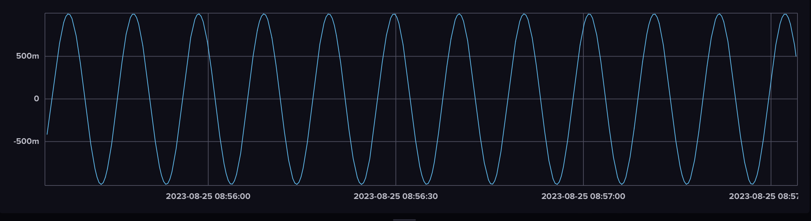

# InfluxDB experiment

## Setup the InfluxDB server 

### Install & Start

```bash
brew update
brew install influxdb
brew install influxdb-cli
```

Start the db server.
```bash
influxd
```

### Configure the operator token

Use the [web-ui](http://localhost:8086) to setup an org and operator token.
Then store it in macOS keychain
```bash
security add-generic-password -a influxdb -s INFLUXDB_OPERATOR -w
security find-generic-password -a influxdb -s INFLUXDB_OPERATOR -w
```

Load it in your environment through your shell config for easy access.
```bash
# Secrets
export INFLUXDB-OPERATOR=$(security find-generic-password -a influxdb -s INFLUXDB_OPERATOR -w)
```

### Configure the access token
Use influx cli to create an `all access` token and put it in keychain too.
```bash
influx auth create \
  --all-access \
  --host http://localhost:8086 \
  --org chris-corp \
  --token $INFLUXDB_OPERATOR
```

## Python client

### Setup your python environment

```bash
git clone git@github.com:blnknlights/chris-influxdb.git
mkdir chris-influxdb
python3 -m venv venv
source venv/bin/activate
pip install -U pip
pip install click
pip install numpy
pip install keyring
pip install 'influxdb-client[ciso]'
```

### Testing the client library

I made a simple class that you can use to experiment with this, it's in `influx_client.py`.  
there's also a function that you can use to quickly initiate the client and connect, it's called `initiate_client()`

#### influx cli

`influx_cli.py` uses the aforementionned class to implement a simple cli client for you to send or retrieve data

There are 2 entrypoints
```bash
python3 influx_cli.py
Usage: influx_cli.py [OPTIONS] COMMAND [ARGS]...

Options:
  --help  Show this message and exit.

Commands:
  get-data
  send-data
```

Send data, if no params are provided default dummy data will be sent
```bash
python3 influx_cli.py send-data
ok
```

Get data, if not params are provided it gets the dummy data from the past 10 minutes
```bash
python3 influx_cli.py get-data
[
  {
    "result": "_result",
    "table": 0,
    "_start": "2023-08-24T22:16:13.312578+00:00",
    "_stop": "2023-08-24T22:26:13.312578+00:00",
    "_time": "2023-08-24T22:21:49.975795+00:00",
    "_value": 22.5,
    "_field": "temperature",
    "_measurement": "chris_measurement",
    "location": "Prague"
  },
  {
    "result": "_result",
    "table": 1,
    "_start": "2023-08-24T22:16:13.312578+00:00",
    "_stop": "2023-08-24T22:26:13.312578+00:00",
    "_time": "2023-08-24T22:26:07.951224+00:00",
    "_value": 16.0,
    "_field": "temperature",
    "_measurement": "chris_measurement",
    "location": "cork"
  }
  {
    "result": "_result",
    "table": 2,
    "_start": "2023-08-24T22:21:12.805921+00:00",
    "_stop": "2023-08-24T22:31:12.805921+00:00",
    "_time": "2023-08-24T22:30:53.337975+00:00",
    "_value": 36.0,
    "_field": "temperature",
    "_measurement": "chris_measurement",
    "location": "marseille"
  }
]
```

### Sine Wave generator

This just uses numpy to generate a sine wave and uses the helper class to send the values to influxdb over time.
```bash
python3 sine_wave.py
0.009999833334155606
0.01999866669331293
0.029995500202466423
0.039989334186595844
0.04997916927063095
0.05996400647938817
0.06994284733746729
0.0799146939690982
0.08987854919792757
0.0998334166467357
0.10977830083707342
...SNIP...
```

Looking at the right time ranges in the web-ui you should see something like this
  
